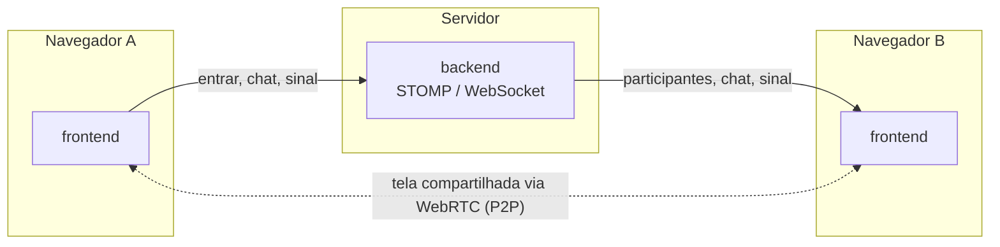

<h1 align="center">Contela</h1>

<p align="center">
  Chat e compartilhamento de tela em tempo real, direto do navegador.
</p>

---

Monorepo com os dois lados do Contela:

- [`be/`](be) — servidor Spring Boot (STOMP/WebSocket) que coordena salas, chat e sinalização WebRTC.
- [`contela-fe/`](contela-fe) — app Next.js onde as pessoas entram na sala, conversam e compartilham a tela.



O backend só participa da sinalização (quem entrou na sala, mensagens de chat, troca de offer/answer/ICE do WebRTC) — o vídeo da tela compartilhada nunca passa pelo servidor, vai direto de um navegador para o outro.

## Rodando localmente

```bash
# terminal 1
cd be
./mvnw spring-boot:run

# terminal 2
cd contela-fe
npm install
npm run dev
```

Abra [http://localhost:3000](http://localhost:3000) em duas abas pra testar com mais de uma pessoa na sala.

Detalhes de cada lado (stack, estrutura, deploy) estão nos READMEs de [`be/`](be/README.md) e [`contela-fe/`](contela-fe/README.md).

## Testes

```bash
# unitários do backend (regras de sala, senha, limites, versão)
cd be
./mvnw test

# integração: sobe o backend de verdade e ataca a sala pelo WebSocket
# (autorização no broker, forja de mensagens, palco, anfitrião, encerramento de sala, aviso de versão)
cd be && ./mvnw -DskipTests package
cd ../contela-fe && npm ci && npm run test:integracao
```

Cada suíte de integração sobe um backend novo em uma porta própria (a partir de `8100`), então elas não interferem entre si.

## Integração contínua e releases

- **CI** (`.github/workflows/ci.yml`): a cada push no `main` e em pull requests roda os testes do backend, tipos, lint e build do front, e as suítes de integração.
- **Release** (`.github/workflows/release.yml`): ao enviar uma tag `vX.Y.Z`, gera os instaladores do Windows e cria o Release no GitHub com eles anexados.

Para publicar uma versão:

1. Suba a versão em `contela-fe/package.json` (ex: `0.1.4`) e faça commit e push.
2. Crie e envie a tag: `git tag v0.1.4 && git push origin v0.1.4`.
3. O workflow confere que a tag bate com o `package.json`, gera os `.exe` e cria o Release (as notas são geradas automaticamente e podem ser editadas depois).

O Release inclui também `latest.yml` e o `.blockmap`: é com eles que o app instalado (versão "Setup") descobre e baixa atualizações sozinho, via `electron-updater`. Ao abrir, uma janela de abertura verifica se há versão nova (espera no máximo 5 segundos); se houver, baixa, instala e reinicia sozinha, e se não houver, o app abre. Depois disso, a verificação se repete a cada 4 horas, com o download em segundo plano e um aviso no canto da tela ("Reiniciar" ou instala ao fechar). Para ver a janela de abertura sem uma atualização real: `CONTELA_ABERTURA_DEMO=1 npx electron . --static` (depois de `npm run electron:static` ao menos uma vez). A versão portátil não se atualiza sozinha; ela continua recebendo o aviso de nova versão do servidor.

Opcionalmente, crie também a variável `WEB_URL` (o endereço da versão web, quando existir). Com ela, o app de desktop copia um link web no convite, em vez de só o link `contela://`.

Uma vez, nas configurações do repositório (Settings > Secrets and variables > Actions > Variables), crie a variável `WS_URL` com o endereço do backend, por exemplo `https://seu-backend.onrender.com/wsock`. É ela que o build embute no app. Depois de publicar, defina `APP_VERSAO_ATUAL` no backend para avisar quem está em versões antigas.
