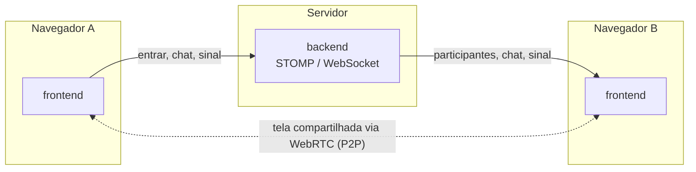

<h1 align="center">Contela</h1>

<p align="center">
  Chat e compartilhamento de tela em tempo real, direto do navegador.
</p>

---

Monorepo com os dois lados do Contela:

- [`backend/`](backend) — servidor Spring Boot (STOMP/WebSocket) que coordena salas, chat e sinalização WebRTC.
- [`frontend/`](frontend) — app Next.js onde as pessoas entram na sala, conversam e compartilham a tela.



O backend só participa da sinalização (quem entrou na sala, mensagens de chat, troca de offer/answer/ICE do WebRTC) — o vídeo da tela compartilhada nunca passa pelo servidor, vai direto de um navegador para o outro.

## Rodando localmente

```bash
# terminal 1
cd backend
./mvnw spring-boot:run

# terminal 2
cd frontend
npm install
npm run dev
```

Abra [http://localhost:3000](http://localhost:3000) em duas abas pra testar com mais de uma pessoa na sala.

Detalhes de cada lado (stack, estrutura, deploy) estão nos READMEs de [`backend/`](backend/README.md) e [`frontend/`](frontend/README.md).
