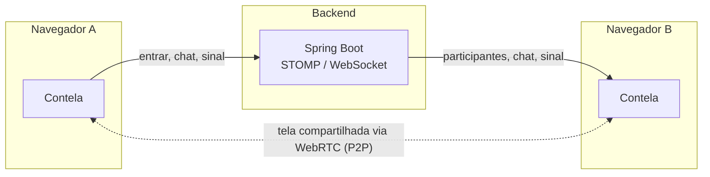

<h1 align="center">Contela</h1>

<p align="center">
  Chat e compartilhamento de tela em tempo real, direto do navegador — sem instalar nada.
</p>

<p align="center">
  <a href="#stack">Stack</a> ·
  <a href="#como-funciona">Como funciona</a> ·
  <a href="#rodando-localmente">Rodando localmente</a> ·
  <a href="#estrutura-do-projeto">Estrutura</a> ·
  <a href="#deploy">Deploy</a>
</p>

---

Este é o frontend do Contela: uma sala de reunião minimalista onde qualquer pessoa entra com um nome e o código de uma sala, conversa por chat e compartilha a própria tela via WebRTC. Sem contas, sem instalação, sem app nativo.

O backend (Spring Boot) que faz a sinalização WebRTC e o broadcast das mensagens vive em [`../be`](../be).

## Stack

- **[Next.js 16](https://nextjs.org)** (App Router) + **React 19** + **TypeScript**
- **Tailwind CSS v4** para estilo
- **[STOMP.js](https://stomp-js.github.io/stomp-websocket/) + SockJS** para o canal de sinalização com o backend
- **WebRTC** nativo do navegador (`RTCPeerConnection`, `getDisplayMedia`) para o P2P de tela

## Como funciona



- O backend só participa da troca de **sinalização** (quem entrou, mensagens de chat, offer/answer/ICE do WebRTC) — o vídeo da tela compartilhada nunca passa pelo servidor, vai direto de um navegador para o outro.
- Só uma pessoa compartilha a tela por vez: se alguém começa a compartilhar enquanto outra pessoa já está, a anterior é parada automaticamente e substituída.
- A grade de participantes se redimensiona sozinha (mesmo algoritmo usado por Zoom/Meet/Discord): calcula o maior quadrado possível para caber todo mundo, e recalcula a cada entrada/saída.

## Rodando localmente

Pré-requisitos: [Node.js 20+](https://nodejs.org) e o [backend](../be) rodando em `localhost:8080`.

```bash
npm install
npm run dev
```

Abra [http://localhost:3000](http://localhost:3000). Abra em duas abas (ou dois navegadores) pra testar com mais de uma pessoa na sala.

## Estrutura do projeto

```
app/
├── components/     componentes de UI reutilizáveis (Avatar, ChatPanel, VideoStage, ...)
├── pages/          as duas telas do app (entrarTela, compartilhamentoTela)
├── hooks/          useSalaConexao — toda a orquestração de estado/WebSocket/WebRTC
├── lib/            cliente STOMP/WebSocket e o gerenciador de WebRTC
├── types/          tipos compartilhados com o payload do backend
└── page.tsx        componente fino — só decide qual tela renderizar
```

## Deploy

Dá pra hospedar o front e o [backend](../be) separadamente (ex: [Render](https://render.com)). Antes de colocar no ar:

- Defina `NEXT_PUBLIC_WS_URL` (ex: `https://seu-backend.onrender.com/wsock`) na hora do build do front. Sem ela, o front tenta falar com o backend em `localhost:8080`.
- No backend, `APP_CORS_ALLOWED_ORIGINS` precisa listar a origem do front (e `app://contela` para o app desktop).
- Para a transmissão funcionar entre redes diferentes, configure um servidor TURN no backend com `APP_ICE_TURN_URLS`, `APP_ICE_TURN_USERNAME` e `APP_ICE_TURN_CREDENTIAL`.
- (Opcional) Defina `NEXT_PUBLIC_GIPHY_API_KEY` na hora do build pra habilitar o botão de GIF no chat (busca no [Giphy](https://developers.giphy.com/), que tem uma chave "Beta" gratuita liberada na hora). Sem ela, o botão simplesmente não aparece.

## Privacidade e segurança

- Nada é gravado: vídeo, áudio e mensagens do chat não ficam salvos no servidor. Não há cadastro, e o servidor só conhece o apelido e o código da sala enquanto a pessoa está nela.
- Cada sala tem um código aleatório e, opcionalmente, uma senha (sugerida por padrão ao criar a sala). O anfitrião pode remover pessoas e encerrar a transmissão de alguém.
- A hospedagem do servidor e os servidores STUN/TURN enxergam o endereço IP de quem se conecta, e os participantes de uma sala podem ver o IP uns dos outros pela conexão direta.
- Se o botão de GIF estiver habilitado, a busca e as imagens vêm direto do Giphy: quem usa essa busca troca dados com os servidores deles, e o backend do Contela só permite enviar no chat GIFs hospedados em `giphy.com`.
- O Contela não é direcionado a crianças e adolescentes. Responsáveis: prefiram salas com senha, criadas por alguém que vocês conheçam.
- **Denúncias e pedidos de ajuda:** linkpetprofessional@gmail.com. Informe o código da sala, o dia e o horário e o que aconteceu. Em risco imediato, ligue 190 (polícia) ou 192 (SAMU); para violações contra crianças e adolescentes, também há o Disque 100 e a SaferNet Brasil.

Os mesmos avisos aparecem dentro do app, em "Privacidade, segurança e denúncias".
