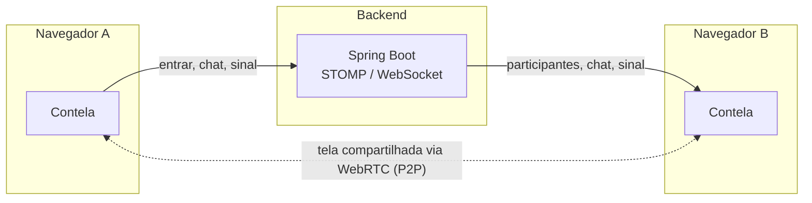

<h1 align="center">Contela</h1>

<p align="center">
  Chat e compartilhamento de tela em tempo real, direto do navegador — sem instalar nada.
</p>

<p align="center">
  <a href="#stack">Stack</a> ·
  <a href="#como-funciona">Como funciona</a> ·
  <a href="#rodando-localmente">Rodando localmente</a> ·
  <a href="#estrutura-do-projeto">Estrutura</a> ·
  <a href="#deploy">Deploy</a>
</p>

---

Este é o frontend do Contela: uma sala de reunião minimalista onde qualquer pessoa entra com um nome e o código de uma sala, conversa por chat e compartilha a própria tela via WebRTC. Sem contas, sem instalação, sem app nativo.

O backend (Spring Boot) que faz a sinalização WebRTC e o broadcast das mensagens vive em [`../backend`](../backend).

## Stack

- **[Next.js 16](https://nextjs.org)** (App Router) + **React 19** + **TypeScript**
- **Tailwind CSS v4** para estilo
- **[STOMP.js](https://stomp-js.github.io/stomp-websocket/) + SockJS** para o canal de sinalização com o backend
- **WebRTC** nativo do navegador (`RTCPeerConnection`, `getDisplayMedia`) para o P2P de tela

## Como funciona



- O backend só participa da troca de **sinalização** (quem entrou, mensagens de chat, offer/answer/ICE do WebRTC) — o vídeo da tela compartilhada nunca passa pelo servidor, vai direto de um navegador para o outro.
- Só uma pessoa compartilha a tela por vez: se alguém começa a compartilhar enquanto outra pessoa já está, a anterior é parada automaticamente e substituída.
- A grade de participantes se redimensiona sozinha (mesmo algoritmo usado por Zoom/Meet/Discord): calcula o maior quadrado possível para caber todo mundo, e recalcula a cada entrada/saída.

## Rodando localmente

Pré-requisitos: [Node.js 20+](https://nodejs.org) e o [backend](../backend) rodando em `localhost:8080`.

```bash
npm install
npm run dev
```

Abra [http://localhost:3000](http://localhost:3000). Abra em duas abas (ou dois navegadores) pra testar com mais de uma pessoa na sala.

## Estrutura do projeto

```
app/
├── components/     componentes de UI reutilizáveis (Avatar, ChatPanel, VideoStage, ...)
├── pages/          as duas telas do app (entrarTela, compartilhamentoTela)
├── hooks/          useSalaConexao — toda a orquestração de estado/WebSocket/WebRTC
├── lib/            cliente STOMP/WebSocket e o gerenciador de WebRTC
├── types/          tipos compartilhados com o payload do backend
└── page.tsx        componente fino — só decide qual tela renderizar
```

## Deploy

Dá pra hospedar o front e o [backend](../backend) separadamente (ex: [Render](https://render.com)). Antes de colocar no ar:

- `WS_URL` em `app/lib/websocket.ts` — hoje aponta pra `http://localhost:8080/wsock`, precisa virar variável de ambiente.
- O CORS do backend já é configurável (veja o [README do backend](../backend)) — só falta apontar pro domínio real do frontend publicado.

Sem o `WS_URL` correto, o front em produção não consegue falar com o backend em produção.
